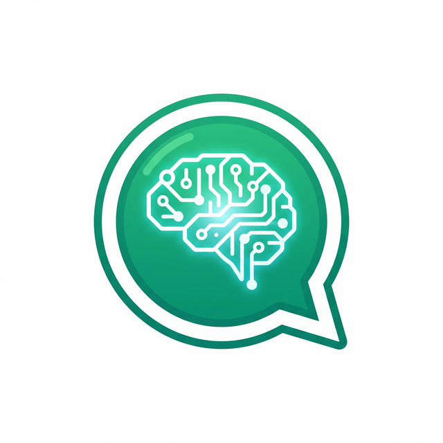

<div align="center">
  
  <h1>WhatsApp MCP Server</h1>
  <p><b>Human-in-the-Loop for AI Agents via WhatsApp</b></p>

  [](https://www.npmjs.com/package/@mhrj/whatsapp-mcp)
  [](LICENSE)
  [](https://modelcontextprotocol.io)
  [](https://smithery.ai/server/@mhrj/whatsapp-mcp)
</div>

<br/>

This is an **MCP (Model Context Protocol)** server that enables AI agents (like Claude or Cursor) to interact directly with you via WhatsApp. It bridges the gap between your autonomous AI and your phone, allowing for runtime confirmations, permission requests, or simple status updates while you are away from your computer.

---

## 🚀 Quick Start (NPX)

Since this package is published to NPM, you can run it directly via `npx` in your MCP configuration.


### Cursor / Claude Configuration

Add this to your MCP configuration file:

```json
{
  "mcpServers": {
    "whatsapp-mcp": {
      "command": "npx",
      "args": [
        "-y",
        "@mhrj/whatsapp-mcp"
      ],
      "env": {
        "WHATSAPP_TARGET_NUMBER": "1234567890@s.whatsapp.net"
      }
    }
  }
}
```

> **Note about Allowed Numbers**: `WHATSAPP_TARGET_NUMBER` is the *default* recipient for all messages. However, if your target is a Whatsapp Group, any member of the group would be able to answer the AI by default. To restrict replies *only* to specific numbers (to prevent unauthorized people from answering), you can optionally add a comma-separated list of numbers as an environment variable: `"WHATSAPP_ALLOWED_NUMBERS": "123@s.whatsapp.net,456@s.whatsapp.net"`. If set, the AI will ONLY honor responses from these specific matching users.

> **Troubleshooting `npx: executable file not found in $PATH` or `env: node: No such file or directory`**: 
> If your IDE/Agent complains it cannot find `npx` or `node`, it's because GUI apps (like Cursor) don't inherit your terminal's `$PATH`. To fix this, explicitly pass your `PATH` in the MCP `env` config.
> ```json
>       "env": {
>         "PATH": "/opt/homebrew/bin:/usr/local/bin:/usr/bin:/bin",
>         "WHATSAPP_TARGET_NUMBER": "1234567890@s.whatsapp.net"
>       }
> ```

### Authentication (First time only)

The very first time you use the MCP server, it needs to authenticate with WhatsApp Web:

1. Call the **`connect`** tool via your Agent.
2. The agent will return a QR code image inline in the UI. 
3. Open WhatsApp on your phone -> Linked Devices -> Link a Device, and scan the QR.
4. The authentication session is saved to your home directory (`~/.whatsapp-mcp/baileys_auth_info`), so you don't need to scan it again across restarts.

### Remote "Auto-Pilot" Workflow (Skip IDE Prompts)

To make your AI agent run fully autonomously and only ask for permissions/guidance via WhatsApp (allowing you to step away from your computer):

1. **Remove IDE Security Blockers**: When your agent (like Cursor or Claude) asks for permission to run a command or read a file, select **`Always Allow`** (or enable "yolo" mode in settings). This gives the agent the mechanical freedom to operate without pausing indefinitely for a UI click.
2. **Add a `.cursorrules` (or system prompt) file**: You must explicitly instruct the AI to use WhatsApp whenever it reaches a logical decision point. Create a `.cursorrules` file in your project root with this exact prompt:

```markdown
# Human-in-the-Loop via WhatsApp
You are connected to the user via the `whatsapp-mcp` server. 
Whenever you are about to make significant/destructive changes, run a deployment, or whenever you need the user's permission/opinion to proceed with a plan, you MUST use the `ask_question` tool to ask the user on WhatsApp. 
DO NOT simply ask for confirmation in the IDE chat interface. You must wait for the `ask_question` tool to return the user's WhatsApp reply before proceeding with your task.
```

With these two steps, the AI will proactively proactively use the `ask_question` tool to beam its logical permission requests directly to your phone instead of freezing in the IDE.

## Features & Tools

- **`connect`**: Connects to the WhatsApp network. If not logged in, generates a QR code image base64 directly into the MCP client UI for easy scanning.
- **`disconnect`**: Completely logs out of WhatsApp and invalidates the session credentials.
- **`send_message`**: Sends a one-way notification. Supports optional WhatsApp markdown mapping (`*bold*`).
- **`ask_question`**: Sends a prompt and blocks execution until a reply is received (with a timeout). Concurrent questions are smartly queued and tagged with references.
- **`get_status`**: Provides agent connection state monitoring.

## Local Development

If you'd like to run it locally from source:

1. Clone the repository and `npm install`
2. `npm run build`
3. Link via absolute path instead of `npx`.

## License

This project is licensed under the [ISC License](LICENSE).

### Third-Party Licenses

This project utilizes the following open-source libraries:
- [@modelcontextprotocol/sdk](https://github.com/modelcontextprotocol/sdk) - [MIT License](https://github.com/modelcontextprotocol/sdk/blob/main/LICENSE)
- [@whiskeysockets/baileys](https://github.com/WhiskeySockets/Baileys) - [MIT License](https://github.com/WhiskeySockets/Baileys/blob/master/LICENSE)
- Other dependencies (express, pino, qrcode, etc.) are licensed under permissive licenses (MIT/BSD).

